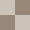

#  PGNgrid

PGNgrid to prosta i intuicyjna aplikacja webowa, która pozwala na wizualizację partii szachowych z plików PGN. Zamiast przeglądać ruchy jeden po drugim, aplikacja renderuje całą partię jako siatkę plansz szachowych, gdzie każda plansza przedstawia pozycję po kolejnym posunięciu.

Jest to idealne narzędzie dla analityków, trenerów i miłośników szachów, którzy chcą szybko przeanalizować kluczowe momenty partii, wzorce pozycyjne lub błędy taktyczne.

Aplikację można przetestować pod adresem: **[https://fikasp.github.io/pgngrid](https://fikasp.github.io/pgngrid)**

## 🔗 Główne funkcje

* **Wczytywanie plików PGN:** Proste przeciągnij i upuść lub wybierz plik z komputera. Aplikacja obsługuje pliki z wieloma partiami, umożliwiając łatwe przełączanie się między nimi.
* **Wizualizacja:** Każdy ruch w partii jest renderowany na osobnej planszy, co tworzy widok "siatki" postępu gry.
* **Interaktywna analiza:** Możliwość powiększenia wybranej planszy w celu lepszego widoku. W trybie powiększenia, możesz przewijać kolejne ruchy za pomocą strzałek na klawiaturze lub kółka myszy.
* **Konfigurowalne ustawienia:**
    * **Orientacja:** Wybór, czy plansze mają być oglądane z perspektywy białych, czy czarnych.
    * **Rozmiar planszy:** Możliwość dostosowania wielkości planszy poprzez zmianę ilości kolumn.
    * **Kolory:** Dostosowywanie kolorów ciemnych pól oraz koloru podświetlenia ostatniego ruchu.
* **Intuicyjna nawigacja:** Łatwe przełączanie się między partiami za pomocą listy rozwijanej lub przewijania kółkiem myszy.
* **Wydruk do PDF:** Opcja wydruku siatki plansz, idealna do tworzenia materiałów treningowych lub analiz offline.

## 📄 Wskazówki użytkowania

1.  **Wczytaj plik PGN:** Przeciągnij i upuść plik `.pgn` na centralny obszar strony, kliknij ikonę folderu lub wklej tekst.
2.  **Przeglądaj partie:** Jeśli plik zawiera wiele partii, wybierz interesującą Cię grę z listy rozwijanej w nagłówku. Możesz również użyć kółka myszy na liście, aby szybko przechodzić do kolejnych partii.
3.  **Powiększ widok:** Kliknij na dowolną planszę, aby ją powiększyć i przełączyć się w tryb interaktywnej analizy.
4.  **Przewiń ruchy:** Gdy plansza jest powiększona, przewijaj ruchy za pomocą strzałek na klawiaturze (w lewo/w prawo) lub kółka myszy. Aby wrócić do widoku siatki, kliknij w dowolnym miejscu poza planszą lub naciśnij Esc.
5.  **Dostosuj widok:** Kliknij ikonę odwróconych strzałek, aby zmienić orientację planszy, oraz ikonę koła zębatego, aby otworzyć ustawienia i spersonalizować wygląd plansz.
6.  **Drukuj:** Użyj ikony drukarki, aby wydrukować siatkę plansz wybranej partii do pliku PDF lub bezpośrednio na papier. Dostosuj układ plansz za pomocą skali i marginesów wydruku.

## ⚙️ Zastosowane technologie 

* **HTML5:** Struktura.
* **CSS3:** Stylizacja interfejsu.
* **JavaScript (ES6+):** Logika aplikacji.
* **`chess.js`:** Biblioteka do obsługi logiki szachowej i parsowania PGN.
* **`chessboard.js`:** Biblioteka do renderowania interaktywnych plansz szachowych.
* **`Font Awesome`:** Biblioteka ikon.

## ⏱️ Historia wersji 

* **v1.5 (2025-10-03):** 
    * Przebudowa systemu logów konsolowych.
    * Poprawa zachowania przy zmianie rozmiaru okna.
    * Aktualizacja komentarzy dokumentacyjnych.

* **v1.4 (2025-09-26):** 
    * Wprowadzenie metodologii BEM.
    * Gruntowna przebudowa i refaktoryzacja skryptów.
    * Blokada przewijania tła przy otwartym modalu.

* **v1.3 (2025-09-24):** 
    * Zastosowanie czcionki Play.
    * Wprowadzenie systemu logów konsoli.
    * Usprawnienie zapisu do local storage.

* **v1.2 (2025-09-23):** 
    * Usunięcie poziomego suwaka przy liście ruchów.
    * Zmiana sposobu podświetlania aktywnych pól.
    * Możliwość przesuwanie ruchów palcem.

* **v1.1 (2025-09-20):** Aktualizacja interfejsu.
    * Możliwość przeciągania pliku na ikonkę folderu.
    * Wyświetlanie listy ruchów nad powiększoną planszą.
    * Zdefiniowanie loga i domyślnej kolorystyki.

* **v1.0 (2025-09-18):** Pierwsza publiczna wersja aplikacji.
    * Wczytywanie i wizualizacja partii z plików PGN.
    * Tryb interaktywnej analizy z powiększaniem plansz.
    * Konfigurowalne ustawienia wyglądu.
    * Wydruk do PDF.

## ✉️ Kontakt 

Jeśli masz pytania lub sugestie skontaktuj się ze mną pod adresem [fikasp@gmail.com](mailto:fikasp@gmail.com).

Dziękuję za korzystanie z mojej interaktywnej aplikacji!